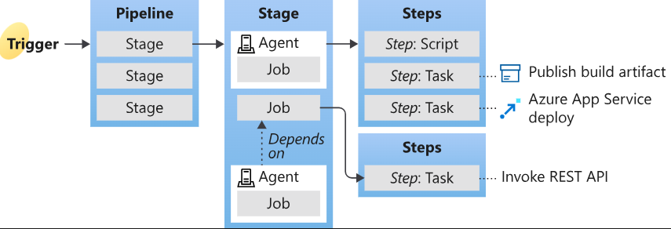

## Azure DevOps

### what is devOps:

A compound of development (Dev) and operations (Ops), DevOps is the union of people, process, and technology to continually provide value to customers.

### Azure Pipelines

How to understand what is an Azure pipeline?

- A trigger tells a Pipeline to run.
- A pipeline is made up of one or more stages. A pipeline can deploy to one or more environments.
- A stage is a way of organizing jobs in a pipeline and each stage can have one or more jobs.
- Each job runs on one agent. A job can also be agentless.
- Each agent runs a job that contains one or more steps.
- A step can be a task or script and is the smallest building block of a pipeline.
- A task is a pre-packaged script that performs an action, such as invoking a REST API or publishing a build artifact.
- An artifact is a collection of files or packages published by a run.

An agent is computing infrastructure with installed agent software that runs one job at a time.

#### Azure yaml

1. How to edit your pipeline? 

    The answer is to use **yaml**.

2. How to edit yaml?

    Select your project, choose Pipelines, and then select the pipeline you want to edit. You have the following options to edit your yaml file:
    - Use keyboard shortcuts:
        - Choose Ctrl+Space for Intellisense support
        - Choose F1 (Fn+F1 on Mac) to display the command palette
    - Use task assistant  
    After editing, you can choose **validate** to save and catch errors  

3. How to manage pipeline variables?
   You get 2 ways to manage:
   - Edit your YAML pipeline and choose Variables to manage pipeline variables.
   - Edit the pipeline and choose More actions > Triggers. Triggers have variable button.

#### Triggers

Use triggers to run a pipeline automatically. Azure Pipelines supports many types of triggers.

#### gates and approvals

#### Manage your pipeline with Azure CLI

Azure CLI(Azure 命令行接口) is a API for managing your Azure. To use it, you ought to download and install Azure CLI. You could manage your pipeline with Azure CLI by "az pipelines" command.

### Deployments:

You can deploy many things or service on Azure by pipelines, such as apps, web service and so on. 

### Repositories

This part has nothing more to say right now. You just need to add your files into the DevOps project.

### Libraries

A library is a collection of build and release assets for an Azure DevOps project. Assets defined in a library can be used in multiple build and release pipelines of the project. The Library tab can be accessed directly in Azure Pipelines.

he library contains two types of assets: variable groups and secure files.

### Artifacts

Azure Artifacts allow developers to publish and consume various types of packages from feeds and public registries like PyPI, Maven Central, and NuGet.org. You can combine Azure Artifacts with Azure Pipelines to publish build and pipeline artifacts, deploy packages, or integrate files across different stages of your pipeline for building, testing, or deploying your application.

My understanding is that Artifacts are like packages management service like pip(python), nuget(.net), maven(java). 

### About resources for Azure Pipelines

A resource is anything used by a pipeline that lives outside the pipeline.

#### Manage resource connection

You can create a connection from Azure Pipelines to external and remote services for executing tasks in a job. Once you establish a connection, you can view, edit, and add security to the service connection.

It means you can use the team resource.

#### Virtual Machine Learning Resource

1. What is Azure Machine Learning resource?
   - Azure virtual machines are one of several types of on-demand, scalable computing resources that Azure offers.  
   - An Azure virtual machine gives you the flexibility of virtualization without having to buy and maintain the physical hardware that runs it. However, you still need to maintain the virtual machine by performing tasks, such as configuring, patching, and installing the software that runs on it.  
   - Azure virtual machines can be used in various ways. Some examples are:
       - Development and test
       - Applications in the cloud
       - Extended datacenter

Use virtual machine (VM) resources to manage deployments across multiple machines with YAML pipelines. VM resources let you install agents on your own servers for rolling deployments.
(使用虚拟机（VM）资源通过YAML流水线管理跨多台机器的部署。VM资源允许您在自己的服务器上安装代理程序以进行滚动部署。)

VM resources connect to environments. After you define an environment, you can add VMs to target with deployments. The deployment history view in an environment provides traceability from your VM to your pipeline.

### Quick Start
This may be the simpest example of using pipeline to train a model. 

You can download the repo in "./repo_test/*"

There are something you need to noticee:
1. Keep your path correct
2. Some python packages are installed with python like os

### Reference
1. [Azure pipeline document](https://learn.microsoft.com/en-us/azure/devops/pipelines/?view=azure-devops)

