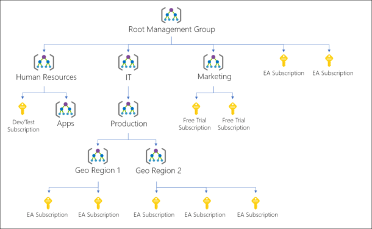

## Group Management

### tentative plan
1. Four members in my team consume the same credit. 

2. You can choose administrator.

3. Only one has the right to approval and manage the resource. 


### My solution:

1. Create a new management group
   The new management group is below *Tenant Root Group*  
   You can see their relationship in the figure below.
     
   You can see Azure resource structure.
     
   You can find an Azure Resource Manager to help manage the group's resource and requests.  
     

2. Add a subscription
   I added my *Azure subscription 1* into the new management group.

3. Add my workmates as *Azure AI Developer*:
   - In *Access Control(IAM)*
   - You can check role detail in [role-assignments-steps](https://learn.microsoft.com/en-us/azure/role-based-access-control/role-assignments-steps)
  
4. How to manage the authorities
   
    
5. How to see the resource cost
    You can check the cost in the Azure Portal.

6. Some helpful tools:
7. Virtual Machine
   - You can create an Azure Virtual Machine and add workmates. 
   - After starting the VM, you can try to log in the VM using codes below:
     ```
     ssh -i ~/.ssh/id_rsa.pem <VM name>@23.99.110.179
     # For example:
     # ssh -i ~/.ssh/id_rsa.pem groupVirtual@23.99.110.179
     ```
8. 


