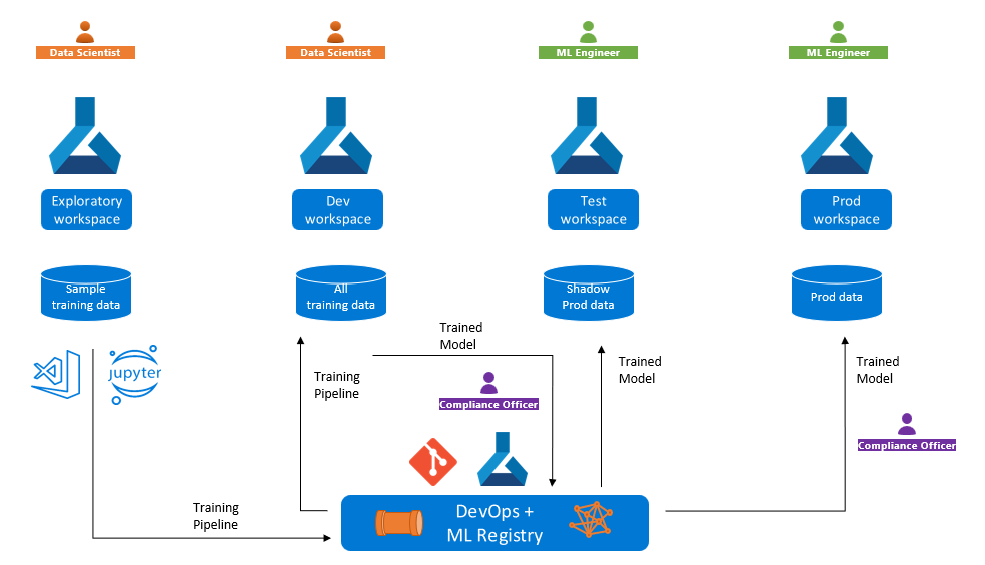

## MLOps

### Overview
Machine Learning Operations (MLOps)

MLOps is based on Azure DevOps. The goals are:
- Faster experimentation and development of models
- Faster deployment of models into production
- Quality assurance and end-to-end lineage tracking

Machine Learning provides the following MLOps capabilities:
- Create reproducible machine learning pipelines.
- Create reusable software environments.
- Register, package, and deploy models from anywhere.
- Capture the governance data for the end-to-end machine learning lifecycle.
- Notify and alert on events in the machine learning lifecycle.
- Monitor machine learning applications for operational and machine learning-related issues.
- Automate the end-to-end machine learning lifecycle with Machine Learning and Azure Pipelines.

In model training, you may meet challenges for model training and deployment:
1. You need to train a model in a development workspace but deploy it an endpoint in a production workspace, possibly in a different Azure subscription or region.
2. You need to develop a training pipeline with test data or anonymized data in the development workspace but retrain the model with production data in the production workspace.

#### registry(注册表)

它将 ML 资产与工作区分离，并将它们托管在一个中心位置，从而使其可用于组织中的所有工作区。

实际流程可以这么理解：


Azure Machine Learning entities can be grouped into two broad categories：
- Assets such as **models**, **environments**, **components**, and **datasets** are durable entities that are workspace agnostic(无关的).
- Resources such as **compute**, **job**, and **endpoints** are transient entities that are workspace specific

Azure Machine Learning registries enable you to create and use those assets in different workspaces.

#### 


### Reference:
1. [MLOps Microsoft](https://learn.microsoft.com/zh-cn/azure/machine-learning/concept-model-management-and-deployment?view=azureml-api-2)


##  Introduction to machine learning operations (MLOps)

Reference: "https://learn.microsoft.com/en-us/training/paths/introduction-machine-learn-operations/"

###  Introduction to DevOps principles for machine learning 

- Train model
- Package model
- Validate model
- Deploy model
- Monitor model
- Retrain model

DevOps是union of people, process and product to enable continuous delivery of value to our end users, by Donovan Brown in [What is DevOps](https://www.donovanbrown.com/post/what-is-devops)?

ML -> DEV -> OPS

ML:
- Exploratory data analysis (EDA)
- Feature engineering
- Model training and tuning

DEV:
- Plan: Define the model's requirements and performance metrics.
- Create: Create the model training and scoring scripts.
- Verify: Check for code and model quality.
- Package: Get ready for deployment by staging the solution.

OPS:
- Release: Deploy the model to production.
- Configure: Standardize infrastructure configurations with Infrastructure as Code (IaC).
- Monitor: Track metrics and ensure the model and infrastructure are performing as expected.

#### DevOps principles

Automation

然后实现automation的关键是CI/CD

##### Continuous integration

- Refactoring exploratory code in Jupyter notebooks into Python or R scripts.
- inting to check for any programmatic or stylistic errors in the Python or R scripts. For
 example, check whether a line in your script contains fewer than 80 characters.
- Unit testing to check the performance of the content of the scripts. For example, check    
 whether the model generates accurate predictions on a test dataset.

To perform linting and unit testing, you can use automation tools like Azure Pipelines in **Azure DevOps**, or **GitHub Actions**.

##### Continuous delivery

To deploy a model to production, you'll first want to package it and deploy it to a pre-production environment. 

Once deploying the model to the staging phase is successful and without errors, you can approve for the model to be deployed to the production environment.

To collaborate on the Python or R scripts to train the model and any necessary code to deploy the model to each environment, you'll use **source control**.

##### Source control

Source control (or version control) is achieved most commonly by working with a Git-based repository.

With machine learning projects, you're likely to have a repository for each project you have.

To decide who works on which part of the project, it's recommended to use **agile planning**.

##### Agile planning

Agile planning means you isolate work into sprints. Sprints are short time-periods during which you want to achieve part of the project's goals.

To plan your work, you may use a tool like **Azure Boards in Azure DevOps**, or **GitHub issues**.

##### Infrastructure as code (IaC)

To repeat and automate the infrastructure needed to train and deploy your model, your team will use Infrastructure as Code (IaC). When you train and deploy models on Azure, IaC means that you define all Azure resources needed in the process in code and the code is stored in a repository.


#### Integrate Azure Machine Learning with DevOps tools

With either sets of tools, there are generally two roles:

- Administrator: sets up the DevOps environment and manages the tools.
- End user: contributes to the project by collaborating on the development. Connects to the tools but has restricted access to the configuration of the DevOps environment.

1. Set up Azure DevOps
2. Connect Azure DevOps to Azure Machine Learning

还可以用github来做：
1. Set up GitHub
2. Connect GitHub with Azure Machine Learning


###  Source control for machine learning projects 

Source control is the practice of managing code and tracking any changes your team makes to the code.

If you work with DevOps tools like Azure DevOps or GitHub, the code is stored in a so-called repository or repo.

#### Repositories and trunk-based development

两种方法建立repo:
- monoepo: 把所有的机器学习工作放在一个repo
- multiple repo: 每个机器学习项目都建立一个repo

#### Structure your repo
For example, you may have the following folders in all your repos:

- .cloud: contains cloud-specific code like templates to create an Azure Machine Learning  
  workspace.
- .ad/.github: contains Azure DevOps or GitHub artifacts like YAML pipelines to automate 
  workflows.
- src: contains any code (Python or R scripts) used for machine learning workloads like 
  preprocessing data or model training.
- docs: contains any Markdown files or other documentation used to describe the project.
- pipelines: contains Azure Machine Learning pipelines definitions.
- tests: contains unit and integration tests used to detect bugs and issues in your code.
- notebooks: contains Jupyter notebooks, mostly used for experimentation.

#### Trunk-based development

使用Git的好处是协作的同时监控成员代码变化

可以用**appoval gates**保证只有经过检查和同意的代码可以提交到produciton

To accomplish the above, Git makes use of trunk-based development which allows you to create **branches**.

The production code is hosted in the main branch. Whenever someone wants to make a change:

You create a full copy of the production code by creating a branch.  
In the branch you created, you make any changes and test them. 
Once the changes in your branch are ready, you can ask for someone to review the changes.  
If the changes are approved, you merge the branch you created with the main repo and the production code will be updated to reflect your changes.  

###  Work with Azure Repos and GitHub repos


### Develop locally with Visual Studio Code

### Verify your code locally

To verify your scripts, there are two common tasks:

- Linting: Check for programmatic or stylistic errors in Python or R scripts.
- Unit testing: Check the performance of the content of the scripts.


###  Automate machine learning workflows

#### Azure Machine Learning pipelines
As a data scientist, you'll work primarily with Azure Machine Learning to train and manage models. After experimentation, you should convert your work into production Python code to allow for automation with Azure (DevOps) Pipelines or GitHub Actions.


一个pipeline的例子：
```
$schema: https://azuremlschemas.azureedge.net/latest/pipelineJob.schema.json
type: pipeline
display_name: nyc-taxi-pipeline-example
experiment_name: nyc-taxi-pipeline-example
jobs:

  transform-job:
    type: command
      raw_data: 
          type: uri_folder 
          path: ./data
    outputs:
      transformed_data:
        mode: rw_mount
    code: src/transform
    environment: azureml:AzureML-sklearn-0.24-ubuntu18.04-py37-cpu@latest
    compute: azureml:cpu-cluster
    command: >-
      python transform.py 
      --raw_data ${{inputs.raw_data}} 
      --transformed_data ${{outputs.transformed_data}}
  
  train-job:
    type: command
    inputs:
      training_data: ${{parent.jobs.transform-job.outputs.transformed_data}}
    outputs:
      model_output: 
        mode: rw_mount
      test_data: 
        mode: rw_mount
    code: src/train
    environment: azureml:AzureML-sklearn-0.24-ubuntu18.04-py37-cpu@latest
    compute: azureml:cpu-cluster
    command: >-
      python train.py 
      --training_data ${{inputs.training_data}} 
      --test_data ${{outputs.test_data}} 
      --model_output ${{outputs.model_output}}
```

然后你可以用下面的code在Azure CLI中运行这个管道。
```
az ml job create --file pipeline-job.yml
```


#### Azure Pipelines

To create the Azure Pipeline, you define the steps you want to include in a YAML file. In the YAML file of the Azure Pipeline, you'll include:

- Trigger: What event initiates the pipeline.
- Stage: A group of jobs commonly aligned with different development environments (dev/test/
  prod).
- Job: A set of steps, which run on an agent. For machine learning workloads, you'll likely
  use a Microsoft-hosted Ubuntu agent.
- Step: A script or task you want to execute. For example, a CLI command, which initiates an
  Azure Machine Learning pipeline (az ml job create).

```
trigger: 
- main

stages:
- stage: deployDev
  displayName: 'Deploy to development environment'
  jobs:
    - deployment: publishPipeline
      displayName: 'Model Training'
      pool:
        vmImage: 'Ubuntu-18.04'
      environment: dev
      strategy:
       runOnce:
         deploy:
          steps:
          - template: aml-steps.yml
            parameters:
              serviceconnectionname: 'spn-aml-workspace-dev'
```

aml-steps.yml:

```
parameters:
- name: serviceconnectionname
  default: ''

steps:
- checkout: self

- script: az extension add -n ml -y
  displayName: 'Install Azure ML CLI v2'

- task: AzureCLI@2
  inputs:
    azureSubscription: ${{ parameters.serviceconnectionname }}
    scriptType: bash
    scriptLocation: inlineScript
    workingDirectory: $(Build.SourcesDirectory)
    inlineScript: |
      cd src
      az ml job create --file aml_service/pipeline-job.yml --resource-group dev-ml-rg --workspace-name dev-ml-ws
  displayName: 'Run Azure Machine Learning Pipeline'
```

#### GitHub Actions
When you want to automate workflows with GitHub, you use GitHub Actions.


###  Continuous deployment for machine learning

#### Set up environments for development and production

How many environments you work with, depends on your organization. Commonly, there are at least two environments: development or dev and production or prod. Plus, you can add environments in between like a staging or pre-production (pre-prod) environment.
With continuous delivery, a typical approach is to:

1. Experiment with model training in the development environment.
2. Move the best model to the staging or pre-prod environment to deploy and test the model.
3. Finally release the model to the production environment to deploy the model so that end-users can consume it.

